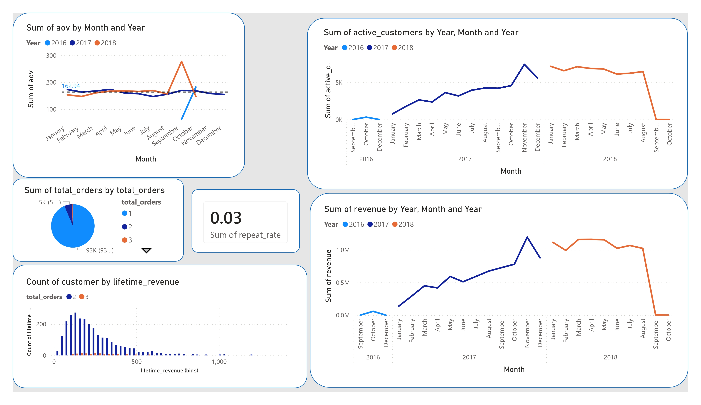
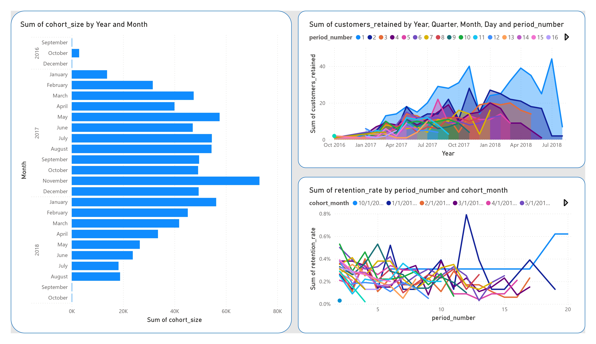
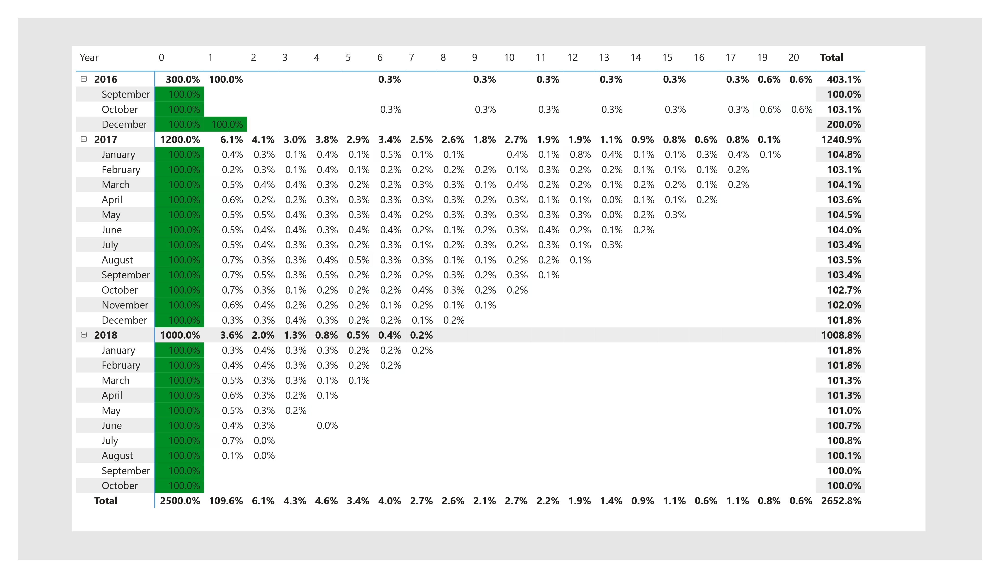

# 🛒 Olist E-Commerce Analytics Project (SQL + Power BI)

## 📌 Project Overview

This project is an end-to-end business analytics case study built on the Olist e-commerce dataset.  
It simulates a real-world analytics environment where raw transactional data is transformed into a structured data model, key business KPIs are defined, cohort retention is analysed, and executive-level insights are generated.

The goal is to replicate how a real analytics team would support decision-making for an e-commerce business.

---

## 🎯 Business Problem

The objective of this project is to understand:

- How the business is performing over time (revenue + customers)
- Whether customers are returning after their first purchase
- Which product categories and regions drive performance
- Why growth is occurring or slowing
- What strategic actions can improve business outcomes

---

## 🧰 Tech Stack

- PostgreSQL (Data storage + SQL transformations)
- SQL (Data modeling + KPI engineering)
- Power BI (Data visualization + dashboarding)
- Excel / CSV (Raw dataset format)

---

## 🏗️ Data Architecture

The project follows a layered data approach:

### 1. Raw Layer
Original Olist datasets imported into PostgreSQL:
- orders
- customers
- order_items
- payments
- products

### 2. Analytics Layer
A centralized fact table:

- `analytics.fact_orders`

This table consolidates:
- Order details
- Customer information
- Revenue metrics
- Product categories
- Delivery performance indicators

---

### 3. Data Model

The entity-relationship diagram below illustrates how the raw tables
relate to each other and feed into the fact table.

<div align="center">
  
</div>


## 📊 KPIs Built

The following business KPIs were developed using SQL:

### Revenue Metrics
- Total revenue
- Monthly revenue trend
- Revenue growth rate

### Customer Metrics
- Active customers per month
- Average order value (AOV)
- Repeat purchase rate

### Retention Metrics
- Cohort retention analysis
- Customer lifetime value distribution

### Operational Metrics
- Delivery delay rate
- Order Geography

---

## 📈 Key Findings

### 1. Strong but Fragile Growth
The business experienced strong growth throughout 2017, peaking in November. Growth was driven primarily by customer acquisition rather than increased spending per customer.

---

### 2. Severe Customer Retention Problem
- ~95% of customers only purchased once
- Repeat purchase rate is ~3%
- Cohort retention drops below 1% after the first purchase cycle

This indicates a heavy reliance on one-time transactions.

---

### 3. Revenue Concentration
A small number of customers contribute disproportionately to total revenue, indicating a highly skewed customer value distribution.

---

### 4. Category Dependency
A few product categories dominate the majority of sales, while many categories contribute minimal revenue.

---

### 5. Geographic Concentration
Most transactions originate from major cities such as São Paulo and Rio de Janeiro, indicating regional dependency.

---

## 📉 Business Recommendations

### 1. Improve Customer Retention (Highest Priority)
- Implement post-purchase engagement campaigns
- Introduce loyalty programs
- Trigger second-purchase incentives

---

### 2. Focus on High-Value Customers
- Segment high lifetime value customers
- Provide targeted offers and personalized experiences
- Study behavior of top spenders

---

### 3. Optimize Product Strategy
- Invest more in top-performing product categories
- Reduce focus on underperforming categories unless strategically necessary

---

### 4. Improve Geographic Diversification
- Expand customer acquisition beyond São Paulo and Rio de Janeiro
- Reduce dependency on a few regions

---

### 5. Increase Average Order Value
- Introduce bundling strategies
- Implement free-shipping thresholds
- Cross-sell complementary products

---

## 📊 Dashboard

An interactive Power BI dashboard was built to visualize:

- Revenue trends over time
- Customer activity trends
- Average order value evolution
- Cohort retention heatmaps
- Category performance distribution

---

## 📷 Dashboard Preview

<div align="center">
  
  
  
</div>

- Executive Overview Dashboard
- Customer Retention Analysis
- Product & Category Performance

---

## 🧠 Skills Demonstrated

This project demonstrates:

- SQL data modeling (fact tables + KPI layers)
- Advanced SQL (CTEs, window functions, cohort logic)
- Business metric design
- Customer retention analysis
- Data storytelling
- Dashboard development in Power BI
- Executive-level communication of insights

---

## 📁 Project Structure
```
olist-kpi-project/
├── data/
├── sql/
│   ├── 01_create_schema.sql
│   ├── 02_load_data.sql
│   ├── 03_fact_orders.sql
│   ├── 04_kpi_views.sql
│   ├── 05_cohort_retention.sql
│   └── 06_business_analysis.sql    
├── dashboard/
│   └── powerbi_dashboard.pbix
│   └── Executive Overview.pdf
│   └── 1executive_overview.jpg
│   └── 2customer_retention.jpg
│   └── 3cohort_analysis.jpg
├── docs/
│   ├── executive_findings.md
│   ├── insights_report.pdf
│   └── data_model.png
└── README.md
```


---

## 🚀 How to Use This Project

1. Clone the repository
2. Set up PostgreSQL database with docker-compose
3. Load raw Olist datasets
4. Run SQL scripts in order
5. Open Power BI dashboard file
6. Explore insights and KPIs

---

## 📌 Key Takeaway

This project simulates a real-world analytics system used by e-commerce companies to monitor performance, understand customer behavior, and guide strategic decisions.

It demonstrates the ability to go from raw data → structured analytics model → business insights → executive dashboard.

---

## 📬 Contact

If you have feedback or questions about this project, feel free to connect using the Issues tab.

---