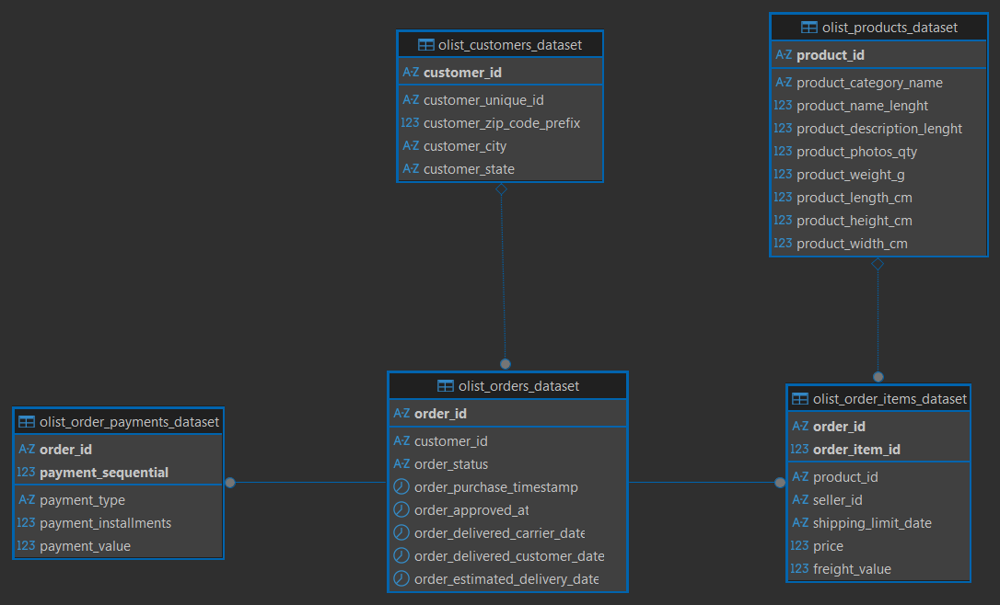

# Olist E-Commerce Analytics : SQL + Power BI

End-to-end analytics case study on the Olist dataset, simulating how a real analytics team supports e-commerce decision-making: from raw data to structured models, KPIs, and executive dashboards.

---

## Tech Stack
PostgreSQL · SQL · Power BI · Excel/CSV

---

## Data Architecture

A layered approach; raw transactional tables transformed into a centralized fact table (`analytics.fact_orders`) consolidating order details, customer info, revenue metrics, and delivery indicators.

### Entity-Relationship Diagram

  
  

---

## Key Findings

**1. Strong but fragile growth** : 2017 revenue grew significantly, peaking in November, but was driven almost entirely by new customer acquisition rather than repeat spending.

**2. Severe retention problem** : ~95% of customers purchased only once. Cohort retention collapses below 1% after the first cycle, indicating near-zero loyalty.

**3. Revenue & category concentration** : A small segment of customers and a handful of product categories generate a disproportionate share of total revenue.

**4. Geographic dependency** : The majority of transactions originate from São Paulo and Rio de Janeiro.

---

## Recommendations

| Priority | Action |
|---|---|
| 🔴 High | Post-purchase campaigns + loyalty program to drive second purchases |
| 🟠 Medium | Segment and personalise offers for high-LTV customers |
| 🟡 Medium | Double down on top-performing categories; reduce tail SKUs |
| 🟢 Low | Expand acquisition beyond core cities; introduce bundling / AOV levers |

---

## Dashboard Preview

  
  
  

*Executive Overview · Customer Retention · Cohort Analysis*

---

## Skills Demonstrated
SQL data modelling · CTEs & window functions · Cohort retention analysis · KPI engineering · Power BI dashboarding · Business storytelling

---

## How to Run
1. Clone the repo and start PostgreSQL via `docker-compose up`
2. Load raw CSVs and run `sql/` scripts in order (`01` → `06`)
3. Open `dashboard/powerbi_dashboard.pbix` for graphical views

# The more detailed version below:
[Open detailed README](FULL_README.md)
